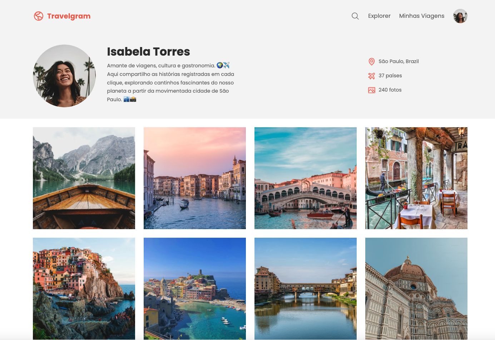

# 🛫 Travelgram - Perfil de Viagens



## 📋 Sobre o Projeto

O **Travelgram** é uma página web que simula um perfil de rede social focado em viagens, inspirado no Instagram. O projeto apresenta o perfil da viajante **Isabela Torres**, mostrando suas experiências, fotos e estatísticas de viagem de forma elegante e responsiva.

### ✨ Características

- **Design Moderno**: Interface limpa e intuitiva com foco na experiência do usuário
- **Layout Responsivo**: Adaptável a diferentes tamanhos de tela
- **Perfil Completo**: Informações pessoais, bio e estatísticas de viagem
- **Galeria de Fotos**: Grid de imagens de viagens com design atrativo
- **Navegação Intuitiva**: Menu de navegação com ícones e links funcionais

## 🚀 Tecnologias Utilizadas

- \*\*HTML5: Estrutura semântica e acessível
- **CSS3**: Estilização moderna com Flexbox e Grid
- **Google Fonts**: Tipografia Poppins para melhor legibilidade
- **Design System**: Cores e componentes consistentes

## 📁 Estrutura do Projeto

```
perfil-de-viagens/
├── assets/
│   ├── icons/          # Ícones SVG (lupa, avião, mapa, etc.)
│   ├── images/         # Imagens de viagens (12 fotos)
│   ├── Logo.svg        # Logo do Travelgram
│   ├── Profile pic.png # Foto de perfil
│   └── readme.png      # Preview do projeto
├── styles/
│   ├── global.css      # Estilos globais
│   ├── nav.css         # Estilos da navegação
│   ├── header.css      # Estilos do cabeçalho
│   ├── main.css        # Estilos do conteúdo principal
│   ├── footer.css      # Estilos do rodapé
│   └── index.css       # Arquivo principal de estilos
├── index.html          # Página principal
└── README.md           # Documentação do projeto
```

## 🎨 Design e Layout

### Seções Principais

1. **Navegação Superior**
   - Logo do Travelgram
   - Menu de navegação com ícones
   - Foto de perfil
     2**Cabeçalho do Perfil**
   - Foto de perfil grande
   - Nome e bio da usuária
   - Estatísticas de viagem (localização, países visitados, fotos)
     3**Galeria de Fotos**
   - Grid responsivo com 12 imagens de viagens
   - Layout em colunas adaptável

4dapé\*\*

- Informações de copyright
- Links para termos e política de privacidade

## 🛠️ Como Executar

### Pré-requisitos

- Navegador web moderno (Chrome, Firefox, Safari, Edge)

### Passos para Execução

1. **Clone o repositório**
   ```bash
   git clone https://github.com/rafaelrhp/perfil-de-viagens.git
   ```

2avegue até a pasta do projeto\*\*

````bash
cd perfil-de-viagens
```3. **Abra o arquivo index.html**
- Duplo clique no arquivo `index.html`
- Ou abra através do seu navegador preferido

### Alternativa: Servidor Local

Para uma experiência mais próxima da produção, você pode usar um servidor local:

```bash
# Usando Python 3
python -m http.server 80

# Usando Node.js (npx)
npx serve .

# Usando PHP
php -S localhost:8000
````

Depois acesse: `http://localhost:80## 🌐 Visualização Online

**Acesse o projeto online:** [https://rafaelrhp.github.io/perfil-de-viagens/](https://rafaelrhp.github.io/perfil-de-viagens/)

## 📱 Responsividade

O projeto foi desenvolvido com foco na responsividade, adaptando-se a diferentes tamanhos de tela:

- **Desktop**: Layout completo com todas as funcionalidades
- **Tablet**: Adaptação do grid de fotos
- **Mobile**: Navegação otimizada e layout em coluna única

## 🎯 Objetivos do Projeto

Este projeto foi desenvolvido como parte do curso **Fullstack da Rocketseat**, com os seguintes objetivos:

- Praticar HTML5 semântico
- Aplicar CSS3 moderno (Flexbox, Grid)
- Desenvolver interface responsiva
- Criar design system consistente
- Implementar boas práticas de acessibilidade

## 📄 Licença

Este projeto está sob a licença MIT. Veja o arquivo [LICENSE](LICENSE) para mais detalhes.

## 👨‍💻 Autor

**Rafael RHP**

- GitHub: [@rafaelrhp](https://github.com/rafaelrhp)
- Projeto: [Travelgram](https://rafaelrhp.github.io/perfil-de-viagens/)

---

⭐ Se este projeto te ajudou, considere dar uma estrela no repositório!
